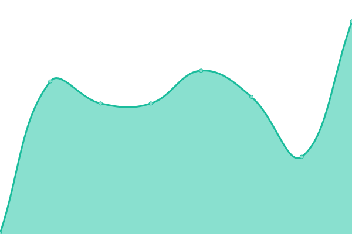
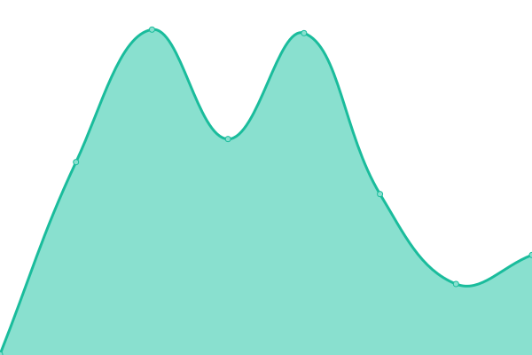
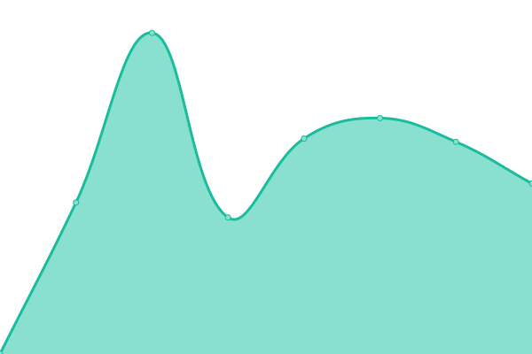

# [📈 Live Status](https://status.estimation.pk): <!--live status--> **🟥 Complete outage**

This repository contains the open-source uptime monitor and status page for [shl](https://status.estimation.pk), powered by [Upptime](https://github.com/upptime/upptime).

With [Upptime](https://upptime.js.org), you can get your own unlimited and free uptime monitor and status page, powered entirely by a GitHub repository. We use [Issues](https://github.com/nsahal/status-estimation-pk/issues) as incident reports, [Actions](https://github.com/nsahal/status-estimation-pk/actions) as uptime monitors, and [Pages](https://status.estimation.pk) for the status page.

<!--start: status pages-->
<!-- This summary is generated by Upptime (https://github.com/upptime/upptime) -->
<!-- Do not edit this manually, your changes will be overwritten -->
<!-- prettier-ignore -->
| URL | Status | History | Response Time | Uptime |
| --- | ------ | ------- | ------------- | ------ |
|  [Estimation.pk Website](https://estimation.pk) | 🟥 Down | [estimation-pk-website.yml](https://github.com/nsahal/status-estimation-pk/commits/HEAD/history/estimation-pk-website.yml) | 

 0ms
     
 | 

<a href="https://status.estimation.pk/history/estimation-pk-website">3.09%</a>
    

|  [Estimation.pk App](https://app.estimation.pk) | 🟥 Down | [estimation-pk-app.yml](https://github.com/nsahal/status-estimation-pk/commits/HEAD/history/estimation-pk-app.yml) | 

 0ms
     
 | 

<a href="https://status.estimation.pk/history/estimation-pk-app">0.00%</a>
    

|  [API Health Check](https://api.estimation.pk/health) | 🟥 Down | [api-health-check.yml](https://github.com/nsahal/status-estimation-pk/commits/HEAD/history/api-health-check.yml) | 

 0ms
     
 | 

<a href="https://status.estimation.pk/history/api-health-check">3.43%</a>
    

|  [API Calculate Quote](https://api.estimation.pk/api/v1/calculate-quote) | 🟥 Down | [api-calculate-quote.yml](https://github.com/nsahal/status-estimation-pk/commits/HEAD/history/api-calculate-quote.yml) | 

 0ms
     
 | 

<a href="https://status.estimation.pk/history/api-calculate-quote">0.31%</a>
    

|  [Database Health](https://api.estimation.pk/health/database) | 🟥 Down | [database-health.yml](https://github.com/nsahal/status-estimation-pk/commits/HEAD/history/database-health.yml) | 

 0ms
     
 | 

<a href="https://status.estimation.pk/history/database-health">2.84%</a>
    

|  [Authentication Service](https://api.estimation.pk/health/auth) | 🟥 Down | [authentication-service.yml](https://github.com/nsahal/status-estimation-pk/commits/HEAD/history/authentication-service.yml) | 

 0ms
     
 | 

<a href="https://status.estimation.pk/history/authentication-service">0.00%</a>
    

<!--end: status pages-->

[**Visit our status website →**](https://status.estimation.pk)

## 📄 License

- Powered by: [Upptime](https://github.com/upptime/upptime)
- Code: [MIT](./LICENSE) © [Anand Chowdhary](https://anandchowdhary.com), supported by [Pabio](https://pabio.com)
- Data in the `./history` directory: [Open Database License](https://opendatacommons.org/licenses/odbl/1-0/)
